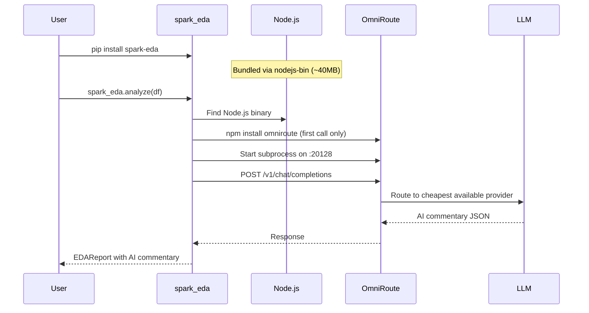

# spark_eda

**Distributed Exploratory Data Analysis and Data Quality Assessment for PySpark — one line of code, zero configuration.**

[](https://www.python.org/downloads/)
[](https://spark.apache.org/)
[](LICENSE)
[](https://github.com/RafaeldaSilvaa/eda_spark/actions)
[](https://pypi.org/project/spark-eda/)
[](https://pypi.org/project/spark-eda/)

```python
import spark_eda

# Complete EDA report — one line
report = spark_eda.analyze(dataframe)

# Data Quality Score — one line
quality = spark_eda.assess_quality(dataframe)

# AI-powered commentary — zero config, automatic
print(report.commentary.executive_analysis if report.commentary else "")
```

---

## Table of Contents

- [Overview](#overview)
- [Features](#features)
- [AI-Powered Commentary](#ai-powered-commentary)
- [Installation](#installation)
- [Quick Start](#quick-start)
- [Usage Examples](#usage-examples)
  - [Complete EDA](#complete-eda)
  - [Data Quality Assessment](#data-quality-assessment)
  - [AI Commentary](#ai-commentary)
  - [Configuration](#configuration)
- [Architecture](#architecture)
- [Output](#output)
- [Environments](#environments)
- [Contributing](#contributing)
- [License](#license)

---

## Overview

`spark_eda` is a production-grade Python library for **distributed** Exploratory Data Analysis (EDA), Data Quality assessment, automatic insight generation, and **AI-powered commentary** on PySpark DataFrames.

Unlike traditional EDA tools that collect data to the driver (and crash on large datasets), `spark_eda` performs **all computations in a distributed manner** using Spark's native functions. No `collect()`, no `toPandas()`, no row-by-row iteration.

It follows a **zero-configuration-by-default** philosophy: import, call, and get a complete report with AI commentary — no API keys, no external services, no setup required.

### Design Principles

- **Distributed-first**: Every operation uses Spark native aggregation — zero driver memory for data
- **Zero config**: `spark_eda.analyze(df)` produces a complete report with zero setup — including AI commentary
- **Deterministic core**: All insights and recommendations come from heuristic rules; AI commentary sits as an assistive overlay that never replaces the deterministic baseline
- **Transparent**: The Data Quality Score (0–100) documents every contributing factor
- **Type-safe**: Full type hints, mypy strict mode, frozen dataclasses
- **Clean Architecture**: 4-layer architecture (Domain → Use Cases → Adapters → Framework) with strict dependency inversion

---

## Features

### Exploratory Data Analysis

| Section | Description |
|---------|-------------|
| **Overview** | Row count, column count, size estimate, duplicate ratio, missing ratio |
| **Schema** | Column names, types, nullability, inferred business types |
| **Statistics** | Numeric (mean, std, quantiles, skewness, kurtosis), categorical (value counts, mode, cardinality), temporal (date range, gaps, frequency), text (length stats, pattern detection), boolean (true/false ratio) |
| **Distributions** | Numeric histograms, categorical frequency charts, temporal distributions |
| **Correlations** | Pearson, Spearman, Cramér's V, Correlation Ratio — auto-selected by column type |
| **Outliers** | IQR, Z-score, MAD strategies — configurable |
| **Insights** | Skewness, nulls, cardinality, duplicates, constants, near-constants, high correlation, zeros — in natural language |
| **Recommendations** | Type fixes, null treatment, outlier handling, schema improvements — priority-sorted |

### AI-Powered Commentary

Every report section includes intelligent, natural-language commentary generated by a **staff-level AI data analyst** (15+ years experience persona):

| Feature | Description |
|---------|-------------|
| **Per-section commentary** | Each of the 9 report sections receives custom AI interpretation — the model sees the raw statistics and explains what they mean in business context |
| **Executive analysis** | A dedicated cross-cutting section that identifies non-obvious patterns, suggests testable hypotheses, and flags business implications spanning multiple sections |
| **Zero infrastructure** | OmniRoute AI gateway is embedded as a managed subprocess — installed and started automatically on first use via bundled Node.js. No API keys, no Docker, no cloud setup |
| **Graceful degradation** | If the AI layer is unavailable (no internet, platform incompatibility), the report renders identically to the deterministic version — zero disruption |
| **Configurable** | Disable entirely with `EDAConfig(ai_enabled=False)`, or configure timeout and cache directory |

### Data Quality

| Feature | Description |
|---------|-------------|
| **Overall Score** | 0–100 weighted score with per-factor breakdown |
| **Completeness** | Null ratios, row-level completeness, empty strings, zero-length fields |
| **Uniqueness** | Duplicate rows, primary key uniqueness, near-duplicates, constant and near-constant columns |
| **Consistency** | Type consistency, range consistency, cross-column logic, schema integrity, referential integrity, format consistency |
| **Timeliness** | Data freshness, temporal completeness, invalid dates, temporal gaps |
| **Accuracy** | Outlier ratio, format validation (CPF, CNPJ, email, UUID, phone), suspicious data, corrupted data, business rules |
| **Top Penalizers** | The 5 factors that most reduced the score — with explanation and affected columns |

### Column Inference

`spark_eda` automatically detects business column types using pure Spark expression trees (no UDFs):

- Brazilian documents: CPF, CNPJ, CEP, phone, RG
- Global patterns: email, UUID, URL, IPv4, credit card
- Technical: auto-increment, primary key candidates, timestamps

---

## AI-Powered Commentary

`spark_eda` embeds the [OmniRoute](https://github.com/diegosouzapw/OmniRoute) AI gateway — an open-source, MIT-licensed router with access to 250+ AI providers (90+ free) — as a managed subprocess.

### How it works



### First-run behavior

On the first EDA analysis with `ai_enabled=True`:
1. `nodejs-bin` (bundled during `pip install`) provides a portable Node.js runtime
2. `npm install omniroute@3.8.48` runs automatically in `~/.cache/spark_eda/omniroute/`
3. OmniRoute starts as a subprocess on `localhost:20128`
4. All subsequent calls use the cached installation

This adds approximately 40–80 MB to the installation (Node.js + OmniRoute dependencies) and may cause a delay of 30–60 seconds on the first analysis while npm install completes.

### Graceful degradation

The AI commentary layer is designed to fail silently:
- **Node.js not available**: Logs a warning, report renders without commentary
- **npm install fails**: Logs a warning, report renders without commentary
- **OmniRoute unreachable**: Logs a warning, report renders without commentary
- **Timeout / HTTP error**: Logs a warning, report renders without commentary
- **`ai_enabled=False`**: No Node.js lookup, no npm install, no subprocess — zero overhead

---

## Installation

### Via pip

```bash
pip install spark-eda
```

This installs `spark_eda` along with `nodejs-bin` (portable Node.js runtime for AI commentary), `httpx`, and all required dependencies.

### From source

```bash
git clone https://github.com/RafaeldaSilvaa/eda_spark.git
cd spark-eda
pip install -e ".[dev,test]"
```

### Requirements

- Python 3.12+
- PySpark 4.0+
- Java 21 (JRE) — required by PySpark
- Internet connection on first use (to download OmniRoute npm package)

---

## Quick Start

### Analyze a DataFrame

```python
from pyspark.sql import SparkSession
import spark_eda

spark = SparkSession.builder.appName("eda").getOrCreate()
df = spark.read.parquet("s3://data/transactions/")

report = spark_eda.analyze(df)

# Auto-renders in Jupyter — includes AI commentary
display(report)

# Or explore programmatically
print(f"Rows: {report.overview.row_count}")
print(f"Columns: {report.overview.column_count}")
print(f"Quality Score: {report.quality.score}")

# AI-powered analysis
if report.commentary:
    print(report.commentary.executive_analysis)
    print(report.commentary.insights)
```

### Assess Data Quality Only

```python
quality = spark_eda.assess_quality(df)

print(f"Overall: {quality.score}")
print(f"Completeness: {quality.dimensions['completeness'].score}")
print(f"Uniqueness: {quality.dimensions['uniqueness'].score}")

# See what hurt the score most
for penalizer in quality.top_penalizers:
    print(f"  -{penalizer.score * penalizer.weight:.1f} pts: {penalizer.reason}")
```

---

## Usage Examples

### Complete EDA

```python
import spark_eda
from spark_eda import EDAConfig

# Zero config — AI included
report = spark_eda.analyze(df)

# Or with custom config
config = EDAConfig(
    max_categories=100,
    correlation_methods=["pearson", "cramers_v"],
    outlier_method="iqr",
    enable_insights=True,
    enable_recommendations=True,
    ai_enabled=True,  # AI commentary enabled by default
    omniroute_url="http://localhost:20128/v1",
    omniroute_timeout=60,  # Seconds before AI call times out
)
report = spark_eda.analyze(df, config=config)
```

### Accessing Individual Sections

```python
# Each section is an independent typed object
overview = report.overview
schema = report.schema
stats = report.stats
distributions = report.distributions
correlations = report.correlations
outliers = report.outliers
quality = report.quality
insights = report.insights
recommendations = report.recommendations

# AI commentary — optional, None if disabled/unavailable
commentary = report.commentary
if commentary:
    print(commentary.overview)
    print(commentary.executive_analysis)

# Each section renders itself
print(overview)  # → Terminal-formatted text
display(schema)  # → HTML table in Jupyter
```

### AI Commentary

```python
from spark_eda import EDAConfig

# Disable AI commentary
config = EDAConfig(ai_enabled=False)
report = spark_eda.analyze(df, config=config)
# report.commentary is None

# Access per-section commentary
report = spark_eda.analyze(df)
if report.commentary:
    report.commentary.overview  # str | None
    report.commentary.schema  # str | None
    report.commentary.quality  # str | None
    report.commentary.stats  # str | None
    report.commentary.distributions  # str | None
    report.commentary.correlations  # str | None
    report.commentary.outliers  # str | None
    report.commentary.insights  # str | None
    report.commentary.recommendations  # str | None
    report.commentary.executive_analysis  # str | None — cross-cutting synthesis
```

### Configuration Reference

```python
from spark_eda import EDAConfig, QualityConfig

# EDA configuration
eda_config = EDAConfig(
    # Core
    max_categories=50,  # Max categories for frequency analysis
    correlation_methods=None,  # Auto-select or ["pearson", "spearman", ...]
    outlier_method="iqr",  # "iqr" | "zscore" | "mad"
    enable_insights=True,
    enable_recommendations=True,
    sampling_threshold=10_000_000,  # Use sampling above this row count
    # AI Commentary
    ai_enabled=True,  # Set False to disable AI entirely
    omniroute_url="http://localhost:20128/v1",
    omniroute_timeout=30,  # HTTP timeout for AI calls (seconds)
    omniroute_cache_dir=None,  # npm cache dir (default: ~/.cache/spark_eda/omniroute/)
)

# Quality-only configuration
quality_config = QualityConfig(
    weights={
        "completeness": 0.30,
        "uniqueness": 0.20,
        "consistency": 0.20,
        "timeliness": 0.15,
        "accuracy": 0.15,
    },
    near_constant_threshold=0.01,  # Columns with <1% variance
)
```

---

## Architecture

`spark_eda` follows **Clean Architecture** with 4 strictly separated layers:

```
spark_eda/
├── domain/          # Entities, Value Objects, Domain Services — pure business logic
├── use_cases/       # Application-specific business rules — orchestrate entities
├── adapters/        # Spark computation, presenters, renderers, omniroute — framework glue
│   └── omniroute/   # AI commentary: OmniRouteManager, OmniRouteClient, PromptBuilder
└── framework/       # SparkSession, config, exceptions — outermost infrastructure
```

### AI Commentary Module

```
adapters/omniroute/
├── __init__.py       # Package exports
├── models.py         # AiCommentary DTO, OmniRouteError
├── manager.py        # OmniRouteManager — Node.js discovery, npm install, subprocess lifecycle
├── client.py         # OmniRouteClient — httpx POST to /v1/chat/completions
└── prompt_builder.py # PromptBuilder — serializes report sections into structured AI prompt
```

**Key architectural decisions:**

| Decision | Rationale |
|----------|-----------|
| **Spark only in adapters** | Domain and Use Cases are 100% testable without Spark — pure pytest |
| **Strategies as adapter pattern** | Stat, correlation, outlier strategies live in the adapter layer because they depend on Spark |
| **Ports for dependency inversion** | DataProvider, CacheProvider, OutputPresenter interfaces in use_cases/ports/ |
| **Presenters separate from entities** | Entities return themselves; Presenters convert them to ViewModels for output |
| **AI as a managed subprocess** | OmniRoute runs as a child process — no Python dependency, no GIL contention, clean process isolation |
| **Lazy initialization** | OmniRoute is installed and started on first AI call, not at import time — zero overhead when disabled |
| **Single-prompt design** | One LLM call generates commentary for all sections + executive analysis — minimizes latency and cost |

---

## Output

### Jupyter Notebook

When used in a Jupyter notebook, `spark_eda` renders a complete HTML report automatically:

- Overview card with key metrics
- Schema table with inferred types
- Quality score gauge with dimension breakdown
- Statistics tables per column type
- Distribution charts (histograms, bar charts)
- Correlation heatmap
- Outlier summary
- Insight cards with severity indicators
- Recommendation list with priority ordering
- **AI Commentary** — per-section inline suggestions labeled as "AI-generated suggestion"
- **Executive Analysis** — dedicated section with cross-cutting AI interpretation

### Terminal

In terminals, the output is a well-formatted text report with:

- Tables with aligned columns
- Color-coded severity indicators (when terminal supports ANSI)
- Compact format suitable for CI/CD logs
- **AI Commentary** — per-section inline notes with `[AI-generated suggestion]` label
- **Executive Analysis** — terminal-formatted synthesis section

### Programmatic Access

Every section is accessible as a typed object with typed attributes:

```python
report.overview.row_count  # int
report.schema.columns["age"]  # ColumnMetadata
report.stats.numeric["age"]  # NumericStats
report.quality.score  # float (0–100)
report.quality.dimensions  # dict[str, QualityDimension]
report.quality.factors  # dict[str, list[QualityFactor]]
report.insights.items  # list[Insight]
report.recommendations.items  # list[Recommendation]
report.commentary  # AiCommentary | None — AI commentary if available
```

### JSON Export

```python
from spark_eda.adapters.renderers import JSONSerializer

json_str = JSONSerializer.serialize_report(report)
# Includes "commentary" key with per-section text or null
```

---

## Environments

`spark_eda` runs anywhere PySpark runs:

- **Jupyter Notebooks / JupyterLab** — auto-rendering HTML reports with AI commentary
- **Databricks** — optimized for Databricks Spark runtime
- **AWS Glue** — compatible with Glue PySpark jobs
- **Amazon EMR** — tested on EMR 7.x
- **Apache Spark standalone** — any SparkSession, any cluster
- **Local development** — `SparkSession.builder.master("local[*]")`

> **AI Commentary note**: The OmniRoute AI gateway uses 90+ free API providers by default. No configuration or API keys are needed — it works out of the box on any platform with internet access.

---

## Contributing

We welcome contributions! Please see [CONTRIBUTING.md](docs/contributing.md) for guidelines.

### Development Setup

```bash
git clone https://github.com/your-org/spark-eda.git
cd spark-eda
pip install -e ".[dev,test]"
```

### Quick Commands

```bash
pytest -m "not integration and not slow"  # Unit + contract tests (fast)
pytest -m "integration"                   # Integration tests (Docker + PySpark)
pytest --cov --cov-report=term            # Coverage report (target: >95%)
ruff check src/ tests/                    # Lint
mypy src/spark_eda/                       # Type check (strict mode)
```

### Coding Standards

- **Docstrings**: Google Style, in Portuguese
- **Code**: English (all identifiers, comments, commits)
- **Naming**: Always fully descriptive — no abbreviations, no single-letter names (except loop counters)
- **Architecture**: Must follow Clean Architecture — no Spark imports in domain or use cases
- **AI Module**: New commentary features go in `adapters/omniroute/` — never modify domain or use cases for AI

### Testing AI Features

The OmniRoute module is fully testable without a running Node.js or OmniRoute instance — all external dependencies are mocked at the unit level:

```bash
pytest tests/unit/adapters/test_omniroute_manager.py -v
pytest tests/unit/adapters/test_omniroute_client.py -v
pytest tests/unit/adapters/test_prompt_builder.py -v
pytest tests/unit/adapters/test_presenter_ai.py -v
pytest tests/unit/adapters/test_renderers_ai.py -v
```

---

## License

MIT License. See [LICENSE](LICENSE) for details.
